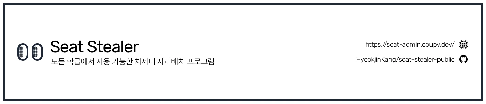

# Seat Stealer

Seat Stealer는 모든 학급에서 사용 가능한 차세대 자리배치 프로그램입니다.  
학생들이 직접 참여하여 원하는 자리를 선택하고, 쟁탈전을 벌이며 자리배치를 하나의 게임으로 즐길 수 있도록 도와줍니다.  

## 사용법 안내
### Seat Stealer 기본 사용법, 온라인 자리배치 사용법 (유튜브)

### 오프라인 자리배치 사용법 (유튜브)

## 피드백
Seat Stealer를 사용하면서 불편한 점이나 개선사항이 있다면 언제든지 피드백을 남겨주세요.  
[피드백 남기기](https://forms.gle/bxGVUTNkPiTGuFap6)
